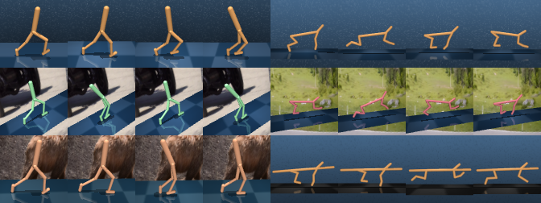

# V-D4RL

<p align="center">
  
</p>

V-D4RL provides pixel-based analogues of the popular D4RL benchmarking tasks, derived from the **`dm_control`** suite, along with natural extensions of two state-of-the-art online pixel-based continuous control algorithms, DrQ-v2 and DreamerV2, to the offline setting. For further details, please see the paper:

**_Challenges and Opportunities in Offline Reinforcement Learning from Visual Observations_**; Cong Lu*, Philip J. Ball*, Tim G. J. Rudner, Jack Parker-Holder, Michael A. Osborne, Yee Whye Teh.

<p align="center">
  <a href=https://arxiv.org/abs/2206.04779>View on arXiv</a>
</p>

## Benchmarks
The V-D4RL datasets can be found [here](https://drive.google.com/drive/folders/15HpW6nlJexJP5A4ygGk-1plqt9XdcWGI?usp=sharing). **These must be downloaded before running the code.** Assuming the data is stored under `vd4rl_data`, the file structure is:

```
vd4rl_data
└───main
│   └───walker_walk
│   │   └───random
│   │   │   └───64px
│   │   │   └───84px
│   │   └───medium_replay
│   │   │   ...
│   └───cheetah_run
│   │   ...
│   └───humanoid_walk
│   │   ...
└───distracting
│   ...
└───multitask
│   ...
```

## Baselines

### Environment Setup
Requirements are presented in conda environment files named `conda_env.yml` within each folder. The command to create the environment is:
```
conda env create -f conda_env.yml
```

Alternatively, dockerfiles are located under `dockerfiles`, replace `<<USER_ID>>` in the files with your own user ID from the command `id -u`.

### V-D4RL Main Evaluation
Example run commands are given below, given an environment type and dataset identifier:

```
ENVNAME=walker_walk # choice in ['walker_walk', 'cheetah_run', 'humanoid_walk']
TYPE=random # choice in ['random', 'medium_replay', 'medium', 'medium_expert', 'expert']
```

#### Offline DV2 
```
python offlinedv2/train_offline.py --configs dmc_vision --task dmc_${ENVNAME} --offline_dir vd4rl_data/main/${ENV_NAME}/${TYPE}/64px --offline_penalty_type meandis --offline_lmbd_cons 10 --seed 0
```

#### DrQ+BC
```
python drqbc/train.py task_name=offline_${ENVNAME}_${TYPE} offline_dir=vd4rl_data/main/${ENV_NAME}/${TYPE}/84px nstep=3 seed=0
```

#### DrQ+CQL
```
python drqbc/train.py task_name=offline_${ENVNAME}_${TYPE} offline_dir=vd4rl_data/main/${ENV_NAME}/${TYPE}/84px algo=cql cql_importance_sample=false min_q_weight=10 seed=0
```

#### BC
```
python drqbc/train.py task_name=offline_${ENVNAME}_${TYPE} offline_dir=vd4rl_data/main/${ENV_NAME}/${TYPE}/84px algo=bc seed=0
```

### Distracted and Multitask Experiments
To run the distracted and multitask experiments, it suffices to change the offline directory passed to the commands above.

## Note on data format
We follow the image sizes and dataset format of each algorithm's native codebase.
The means that Offline DV2 uses `*.npz` files with 64px images to store the offline data, whereas DrQ+BC uses `*.hdf5` with 84px images.
The data collection procedure is detailed in Appendix B of our paper, and we provide conversion scripts in `conversion_scripts`.

## Acknowledgements
V-D4RL builds upon many works and open-source codebases in both offline reinforcement learning and online pixel-based continuous control. We would like to particularly thank the authors of:
- [D4RL](https://github.com/rail-berkeley/d4rl)
- [DMControl](https://github.com/deepmind/dm_control)
- [DreamerV2](https://github.com/danijar/dreamerv2)
- [DrQ-v2](https://github.com/facebookresearch/drqv2)
- [LOMPO](https://github.com/rmrafailov/LOMPO)

## Contact
Please contact [Cong Lu](mailto:cong.lu@stats.ox.ac.uk) or [Philip Ball](mailto:ball@robots.ox.ac.uk) for any queries.
